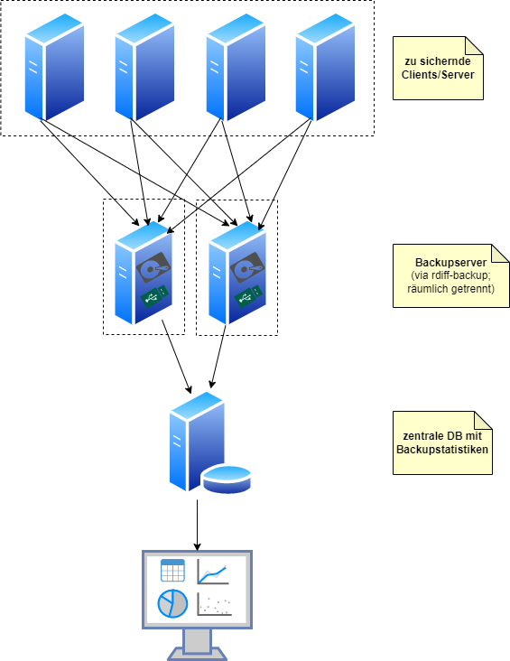
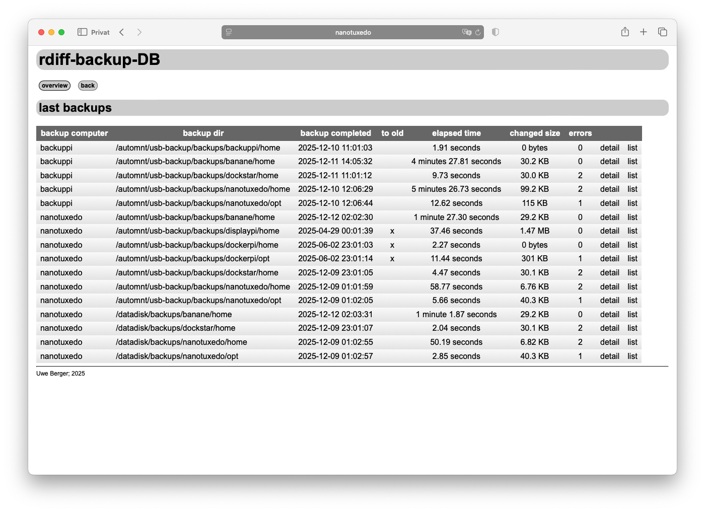
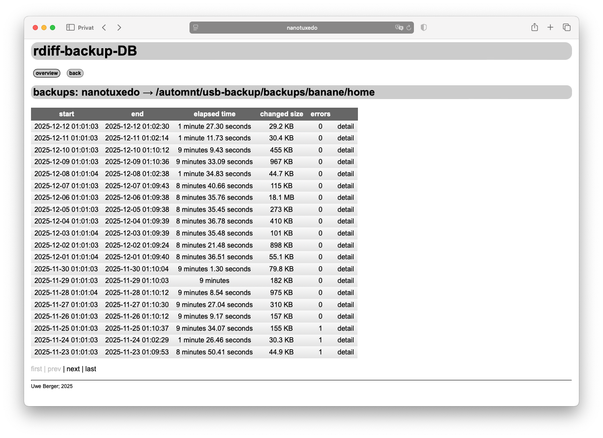
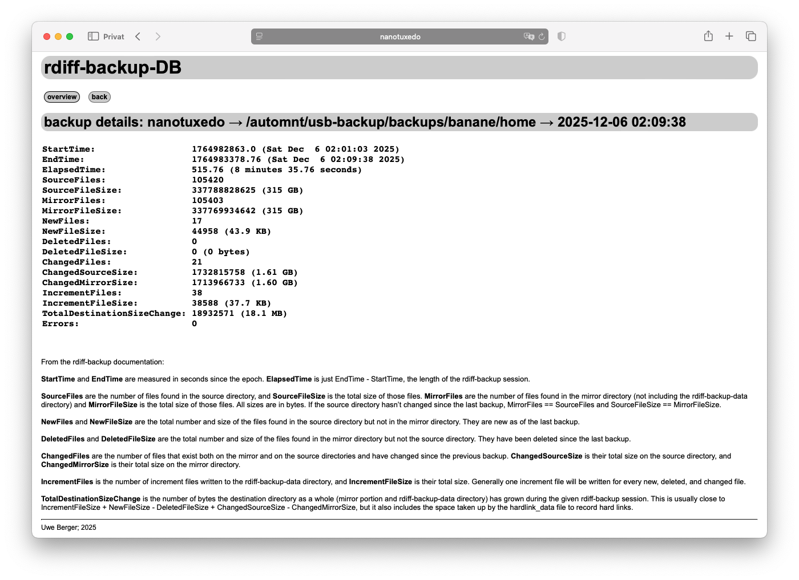

# rdiff-backup-db
Ich sichere meine wichtigen Daten auf den diversen Rechnern/Servern mittels [rdiff-backup](https://rdiff-backup.net/). In meinem entsprechenden Setup verwende ich dazu zwei Backupserver, welche auch räumlich getrennt stehen. Einer der Backupserver sichert die Daten jeweils auf zwei physisch unterschiedliche Speichermedien (interne Festplatte, externes USB-Laufwerk). An dem anderen erfolgt die Sicherung auf ein externes USB-Laufwerk. Zur Überwachung dieser zahlreichen Backups dient dieses hier vorgestellte Tool. 

Nach jedem einzelnen Backup wird die jeweilige [rdiff-backup-Statistik](https://rdiff-backup.net/FAQ.html#what_do_the_various_fields_mean_in_the_session_statistics_and_directory_statistics_files) in einer zentralen Datenbank abgespeichert. Ein Web-Frontend, auf Basis von [web.py](https://webpy.org/), visualiert in geeigneter Art und Weise, sämtliche Backups überblickweise.




Anmerkung: die Überwachung der physischen Laufwerke aller meiner Rechner, also auch der Backup-Medien, erfolgt via [smartctl_db](https://github.com/boerge42/smartctl_db).

## rdiff_backup_db.py
Das Sammeln der Backupstatistik-Daten erfolgt mit diesem Python-Script. Idealerweise erfolgt der Aufruf dieses Scriptes direkt nach dem rdiff-backup. Als Parameter ist das Backup-Ziel (von rdiff-backup) anzugeben.

Hier eines meiner typischen rdiff-backup-Scripte, welche via cron-Job automatisch gestartet werden:

```
#!/bin/bash

COMPUTER="nanotuxedo"
DEST_MOUNT_POINT="/automnt/usb-backup/backups/${COMPUTER}"

SRC=( /home /opt )

# ...ggf. externes Quell-Laufwerk einbinden
# (SRC sieht dann natürlich etwas anders aus!) 

for i in ${SRC[@]}
  do
    echo "Backup: $i --> ${DEST_MOUNT_POINT}$i"
    rdiff-backup -b $i  ${DEST_MOUNT_POINT}$i
    /usr/bin/python3 /home/blabla/rdiff-backup/rdiff_backup_db.py ${DEST_MOUNT_POINT}$i
  done

echo "Backup fertig!"

# ...ggf. unmount externes Quell-Laufwerk 

echo "Fertig!"
```
Dabei wird durch **rdiff_backup_db.py** jeweils die jüngste, also aktuelleste  Statistikdatei (des referenzierten Backup-Verzeichnisses) an eine zentrale Datenbank (siehe Quelltext) übermittelt.

Innerhalb des Scriptes gibt es einen "geheimen" Schalter, welcher zum initialen Befüllen der Datenbank benutzt werden kann. Mit ```mode=all``` werden alle vorhandenen Statistikdateien des angegebenen Zielverzeichnisses eingelesen und in der Datenbank hinterlegt...:
```
...
# **********************************************************************
# alle oder nur jüngste Statistikdatei(en) aus Backup-Dir einlesen
# --> all|latest
mode="all"
...
```
Im "Normal-Betrieb" ist natürlich ```mode=latest``` sinnvoller...!


## web_rdiff_backup/web_rdiff_backup.py
Ein kleines Web-Frontend (auf Basis von [web.py](https://webpy.org/)), welches die gesammelten rdiff-backup-Statistiken in, für mich, geeigneter Weise aufbereitet und anzeigt.

### Startseite
Liste der letzten/jüngsten rdiff-backup-Statistikdaten pro Backup-Zielverzechnis:

In der Spalte "to old" werden alle die Backup-Verzeichnisse gekennzeichnet, deren letztes Backup älter als x Tage ist. Die entsprechende Defintion von "x Tage" erfolgt im Python-Script **web_rdiff_backup.py**:
```
# ********************************
...
DAYS_TO_OLD_BACKUP = 7        # Anzahl Tage, ab dem ein Backup als veraltet markiert wird (index.html)
...
```

Mit den entsprechenden Links in jeder Tabellenzeile kann verzweigt werden zu...:
- **detail**: ...Inhalt der Statistikdaten des **letzten** Backups auf das entsprechende Zielverzeichnis
- **list**: ...Liste aller Backups auf das entsprechende Zielverzeichnis

### Liste aller Backups auf ein rdiff-backup-Zielverzeichnis

Sortierreihenfolge: jüngstes --> ältestes Backup; Link **detail** wie oben beschrieben....

### Inhalt eines (ausgewählten) rdiff-backup-Statistikeintrages

Die Bedeutung der einzelnen Werte ist der Beschreibung auf der Webseite unten bzw. der [originalen Dokumentation](https://rdiff-backup.net/FAQ.html#what_do_the_various_fields_mean_in_the_session_statistics_and_directory_statistics_files) zu entnehmen.

## ToDo
- rdiff-backup-Error-Logs mit in DB aufnehmen/anzeigen?

---
Uwe Berger; 2025

